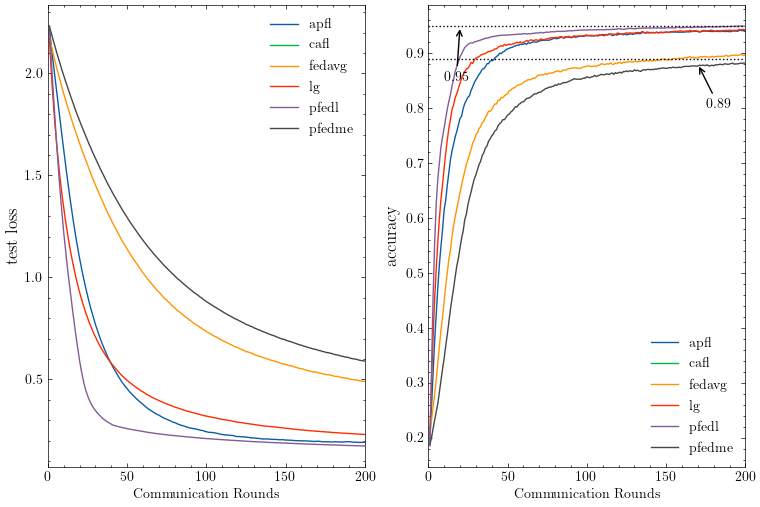

# A Personalized Federated Learning Framework for Heterogeneous Population

This repository implements all experiments in the paper **A Personalized Federated Learning Framework for Heterogeneous Population**.

This repository does not only implement PFedL but also FedAvg, clfl([paper](https://arxiv.org/abs/1910.01991), modifying [repo](https://github.com/felisat/clustered-federated-learning)) and  lg([paper](https://arxiv.org/abs/2001.01523)) algorithms.

# Software requirements:

- numpy, torch, tensorflow, matplotlib
- To download the dependencies: **pip3 install -r requirements.txt**

# Dataset: Currently Mnist Only

- To generate non-idd MNIST Data: 

  run "python3 generate_niid_balanced.py" and "generate_niid_index.py"(for clfl algorithm)

# Produce experiments and figures

Run correspond ipynb files to produce rexperiments result and figure is generated by "python3 plot.py"

